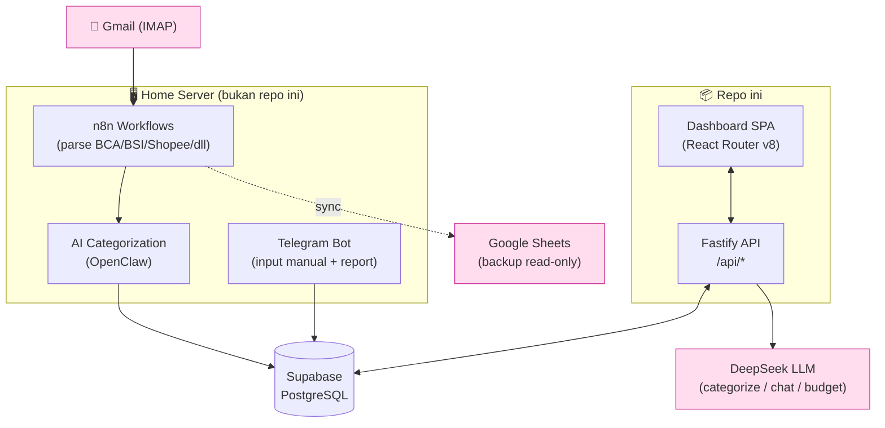
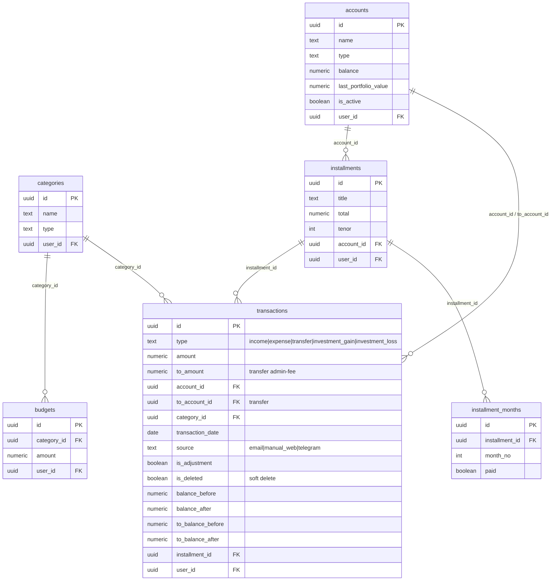
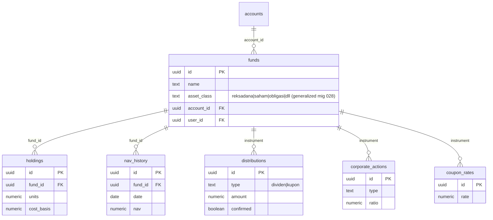
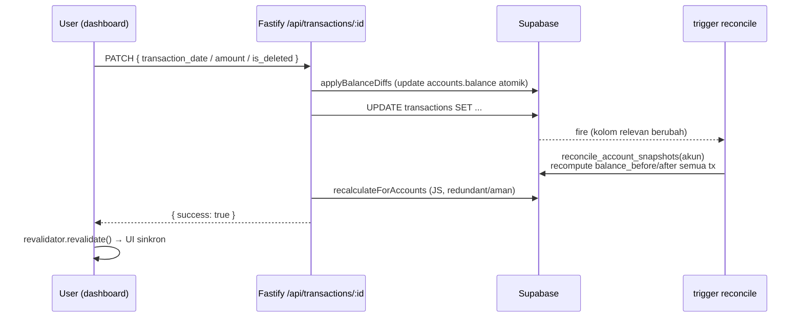
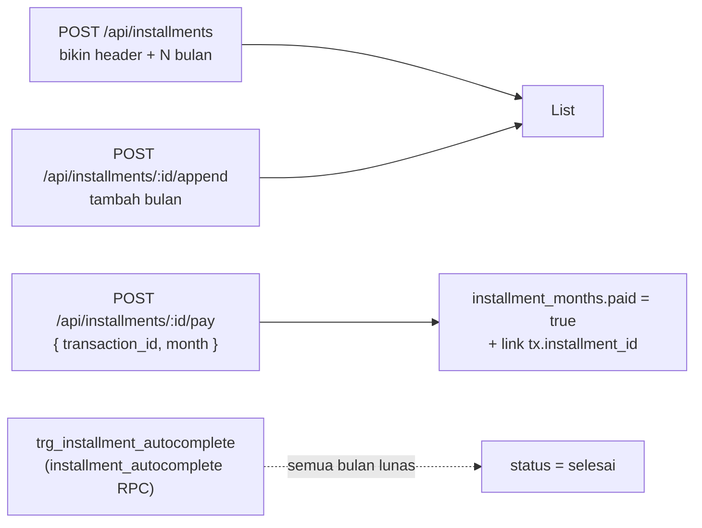
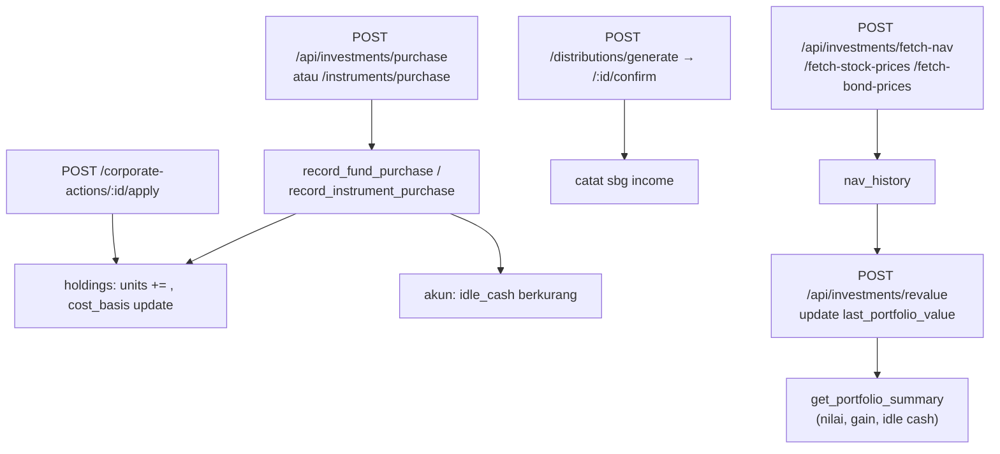
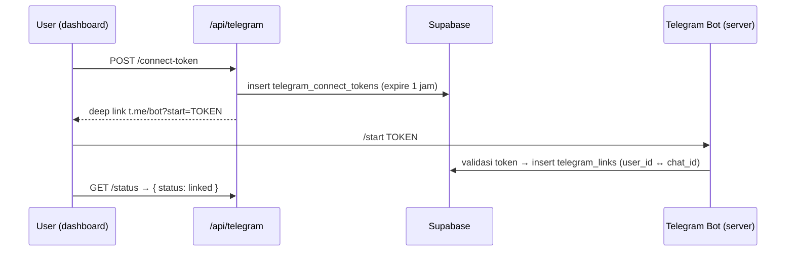

# FEATURES — Peta Fitur & Alur Data

Dokumentasi konkret semua fitur sistem finance (repo ini: `dashboard/` + `api/` + `supabase/`).
Untuk inventori service di server (bot, n8n, openclaw) lihat **`SERVER.md`**. Untuk konvensi coding lihat **`CLAUDE.md`**.

> Diagram pakai [Mermaid](https://mermaid.js.org) — render otomatis di GitHub.

## Daftar Isi

- [1. Arsitektur & Alur Data Global](#1-arsitektur--alur-data-global)
- [2. Data Model](#2-data-model)
- [3. Fitur Dasar](#3-fitur-dasar)
  - [3.1 Accounts (Akun)](#31-accounts-akun)
  - [3.2 Transactions (Transaksi)](#32-transactions-transaksi)
  - [3.3 Categories (Kategori)](#33-categories-kategori)
- [4. Sistem Saldo & Snapshot (Advanced)](#4-sistem-saldo--snapshot-advanced)
- [5. Analytics](#5-analytics)
- [6. Budget](#6-budget)
- [7. Installments (Cicilan)](#7-installments-cicilan)
- [8. Investasi / Portfolio](#8-investasi--portfolio)
- [9. Fitur AI (LLM)](#9-fitur-ai-llm)
- [10. Telegram Integration](#10-telegram-integration)
- [11. Push Notifications](#11-push-notifications)
- [12. Auth & Multi-User](#12-auth--multi-user)
- [13. Internationalization (i18n)](#13-internationalization-i18n)
- [Lampiran: Peta Endpoint](#lampiran-peta-endpoint-api)

---

## 1. Arsitektur & Alur Data Global

Semua service independen, connect langsung ke Supabase (PostgreSQL) sebagai primary DB. Repo ini cuma bagian **dashboard + API + DB**; parsing email, bot, dan AI categorization jalan di home server.



**Runtime:**
- **Dev:** `vite dev :3000` (proxy `/api → :3001`) + `fastify dev :3001`
- **Prod:** satu proses pm2 `finance-api` — Fastify serve SPA static (`dashboard/build/client`) + semua `/api/*` di port 3701

**Sumber transaksi** (`transactions.source`): `email` (n8n), `manual_web` (dashboard/RPC), `telegram` (bot). Dipakai untuk auditability.

---

## 2. Data Model

### Core



### Investasi



### Auth & multi-user

`profiles` (1:1 `auth.users`, punya `role`), `invite_codes`, `telegram_links`, `telegram_connect_tokens`, `push_subscriptions`, `recurring_transactions`. Semua tabel data punya `user_id` + RLS (lihat [§12](#12-auth--multi-user)).

---

## 3. Fitur Dasar

### 3.1 Accounts (Akun)

Kas/bank/e-wallet. Saldo (`balance`) di-update **atomik** (`balance = balance ± amount`) tiap transaksi — bukan read-modify-write di browser (fix lost-update, mig 039).

| Aksi | Endpoint | Catatan |
|---|---|---|
| List/create | `GET`/`POST /api/accounts` | |
| Edit/hapus | `PATCH`/`DELETE /api/accounts/:id` | |
| **Adjust saldo** | `POST /api/accounts/:id/adjust` | Body `{ target_balance }`. Bikin transaksi `is_adjustment=true` sebesar delta; RPC `set_account_balance`. |

Adjustment **di-exclude** dari semua analytics (mig 022) — cuma koreksi saldo, bukan income/expense beneran.

📂 **Kode:** `api/src/routes/accounts.ts`, `accounts-id.ts`, `accounts-id-adjust.ts` · RPC `set_account_balance` (`supabase/migrations/`) · atomik `record_manual_*` (`039_atomic_manual_transaction_fns.sql`) · UI `dashboard/src/routes/balances.tsx`, `components/balances/`

### 3.2 Transactions (Transaksi)

Tipe: `income`, `expense`, `transfer` (+ `investment_gain`/`investment_loss` internal dari modul investasi). Transfer bisa punya `to_amount` beda dari `amount` (admin fee).

**Baca:** `GET /api/transactions` lewat view **`v_transactions`** (join nama kategori/akun, filter `is_deleted=false`).

**Tulis (create):** RPC atomik `record_manual_entry` (income/expense) & `record_manual_transfer` (transfer) — update saldo + insert dalam satu operasi (mig 039). Bot & n8n insert langsung ke tabel.

**Edit/Hapus:** `PATCH`/`DELETE /api/transactions/:id` (`api/src/routes/transactions-id.ts`):
1. Hitung diff efek saldo (`balance-math.ts`), apply ke akun (atomik, dengan rollback kalau gagal).
2. Update/soft-delete row (`is_deleted=true`).
3. `recalculateForAccounts()` recompute snapshot chronologis.
4. **DB trigger** `trg_reconcile_transaction_snapshots` juga fire otomatis → auto-heal snapshot (lihat [§4](#4-sistem-saldo--snapshot-advanced)).

**Soft delete:** `is_deleted` flag, `v_transactions` & semua RPC analytics skip yang deleted.

**Frontend auto-refresh:** setelah edit/hapus, `TransactionListClient` panggil `useRevalidator().revalidate()` → semua loader aktif re-run → UI langsung sinkron (fix anomali saldo basi).

📂 **Kode:** create `api/src/routes/transactions.ts` · edit/delete `transactions-id.ts:88`,`:197` · math `api/src/lib/balance-math.ts` · view `v_transactions` (`003_functions_and_views.sql`) · create atomik `039_atomic_manual_transaction_fns.sql` · UI `dashboard/src/routes/transactions.tsx`, `components/transactions/TransactionListClient.tsx`

### 3.3 Categories (Kategori)

**Per-user** sejak multi-user: `categories.user_id` (`NOT NULL`, RLS `own_rows`), tiap user cuma lihat/kelola kategorinya sendiri. User baru otomatis dapat **copy** set kategori default via `seed_user_data()` (trigger `on_profile_created_seed`) — bukan sharing, jadi bebas diedit sendiri. Type: `income` / `expense` / `both`. Sejak i18n, seed **ikut bahasa** pilihan saat signup (ID/EN) — lihat [§13](#13-internationalization-i18n).

- Create: `POST /api/categories` (set `user_id` dari session, `categories.ts:25`)
- Edit/hapus: `PATCH`/`DELETE /api/categories/:id`
- List: dashboard baca via supabase browser client (RLS auto-filter ke `auth.uid()`), bukan API GET

📂 **Kode:** `api/src/routes/categories.ts`, `categories-id.ts` · kolom+seed+RLS `supabase/migrations/015_auth_and_profiles.sql` (`:23` user_id, `:73` seed, `:42` policy) · backfill NOT NULL `041_backfill_user_id.sql` · RLS multi-user `042_enable_rls_multiuser.sql`

---

## 4. Sistem Saldo & Snapshot (Advanced)

Tiap transaksi nyimpen **snapshot running balance**: `balance_before`/`balance_after` (sisi akun asal), `to_balance_before`/`to_balance_after` (sisi akun tujuan transfer). Ini yang bikin UI bisa nampilin "saldo setelah tiap transaksi" secara historis — dan yang paling rawan jadi anomali kalau salah reconcile.

> 📖 **Deep-dive lengkap + peta kode `file:line`:** [`docs/RECONCILE.md`](./RECONCILE.md). Bagian di bawah ini ringkasannya.

### Kontrak inti

- **`accounts.balance` = source of truth.** Snapshot selalu di-anchor ke saldo akun sekarang, bukan dihitung dari nol.
- Trigger reconcile **preserve** `accounts.balance` — dia cuma nurunin `opening = balance − Σefek` lalu recompute chain. Yang **ubah** saldo cuma RPC (`record_manual_*`) atau API (`applyBalanceDiffs`).
- Urutan kronologis: `ORDER BY transaction_date, created_at, id`.

### Trigger auto-heal

`trg_reconcile_transaction_snapshots` (mig 011, kolom diperluas mig 050) fire otomatis, apapun sumber tulisan (API/telegram/n8n):

```
AFTER INSERT OR DELETE OR UPDATE OF
  type, amount, to_amount, account_id, to_account_id, transaction_date, is_deleted
→ reconcile_account_snapshots(account) untuk tiap akun terdampak
```

Jadi **ganti tanggal** (reorder kronologis) dan **hapus** transaksi otomatis me-recompute snapshot seluruh chain akun — nggak perlu dipanggil manual.



> ⚠️ Karena trigger **preserve** saldo, urutan hapus di prod harus: **decrement saldo dulu → baru set `is_deleted`**, biar trigger baca saldo baru. API sudah handle ini.

### Fungsi & health-check terkait

| Objek | Peran |
|---|---|
| `reconcile_account_snapshots(uuid)` | Recompute snapshot 1 akun (dipanggil trigger). |
| `reconcile_balance_snapshots()` | Recompute global semua akun (manual, mig 018). |
| `recalculateForAccounts()` (JS, API) | Mirror reconcile di sisi API tiap edit/delete. |
| `get_balance_snapshot_anomalies()` | Health-check: cari snapshot yang nggak konsisten (mig 012). |
| `POST /api/transactions/recalculate` | Trigger reconcile manual dari dashboard. |

**Test:** `tests/integration/reconcile-snapshots.test.js` (reorder tanggal, hapus tengah, edit amount, transfer `to_amount`), `tests/integration/atomic-balance.test.js` (lost-update), `tests/unit/balance-snapshot-patch.test.js`.

📂 **Kode:** peta lengkap `file:line` ada di [`docs/RECONCILE.md` §12](./RECONCILE.md#12-peta-kode). Ringkas: `040_reconcile_snapshots_use_to_amount.sql` (fungsi), `050_reconcile_trigger_to_amount.sql` (trigger), `011_reconcile_transaction_snapshots.sql` (trigger fn), `api/src/lib/recalculate-snapshots.ts`.

---

## 5. Analytics

Semua RPC operasi cuma di transaksi **non-deleted & non-adjustment**, timezone `Asia/Jakarta`, Rupiah.

| RPC | Output | Dipakai di |
|---|---|---|
| `get_summary(start,end)` | Total income/expense/net | Home, chat AI |
| `get_category_breakdown(start,end,type)` | Breakdown per kategori | Analytics, chat AI |
| `get_monthly_trend()` | Tren bulanan | Analytics |
| `get_expense_heatmap()` | Heatmap pengeluaran harian | Analytics |
| `get_daily_spending()` | Spending per hari | Insights |
| `get_period_comparison()` | Banding antar periode | Insights |
| `get_top_transactions()` | Transaksi terbesar | Insights |
| `get_savings_rate_trend()` | Tren savings rate (mig 027) | Insights |

📂 **Kode:** RPC di `supabase/migrations/003_functions_and_views.sql`, `021_analytics_rpc_spending_patterns.sql`, `022_exclude_adjustments_from_analytics.sql`, `027_savings_rate_trend_fn.sql` · UI `dashboard/src/routes/home.tsx`, `analytics.tsx`, `insights.tsx`; chart `components/charts/` (recharts).

---

## 6. Budget

Tabel `budgets` (amount per kategori). Halaman `routes/budget.tsx` banding budget vs realisasi (dari `get_category_breakdown`).

**AI Budget Suggest:** `POST /api/budget/suggest` — kirim histori pengeluaran ke DeepSeek, dapat saran alokasi per kategori. Ada enforcement: total saran di-adjust ke kategori terbesar biar sum-nya pas (`budget-suggest.ts:80`).

📂 **Kode:** `api/src/routes/budget-suggest.ts` · UI `dashboard/src/routes/budget.tsx`, `components/budget/`

---

## 7. Installments (Cicilan)

Lacak cicilan multi-bulan. `installments` (header) + `installment_months` (per bulan, `paid` flag). Transaksi bisa di-link ke cicilan via `transactions.installment_id`.



| Aksi | Endpoint |
|---|---|
| List/create | `GET`/`POST /api/installments` |
| Detail/edit | `GET`/`PATCH /api/installments/:id` |
| Bayar 1 bulan | `POST /api/installments/:id/pay` |
| Tambah bulan | `POST /api/installments/:id/append` |

📂 **Kode:** `api/src/routes/installments.ts`, `installments-id.ts`, `installments-id-pay.ts`, `installments-id-append.ts` · schema/trigger `supabase/migrations/005_installments.sql`, `007_installment_months_refactor.sql` · UI `dashboard/src/routes/installments.tsx`, `components/installments/`

---

## 8. Investasi / Portfolio

Modul terbesar. Awalnya reksadana (`funds`), lalu di-generalize jadi instrumen umum (saham/obligasi/dll, mig 028). Nilai portfolio disimpan ke `accounts.last_portfolio_value` (mig 033) biar bisa dipakai di neraca tanpa recompute.

### Konsep

- **Instrument** (`funds`) — reksadana/saham/obligasi, terikat ke sebuah `account`.
- **Holdings** — unit + `cost_basis` (buat hitung gain, mig 034).
- **NAV / harga** (`nav_history`) — di-fetch dari sumber eksternal.
- **Distributions** — dividen/kupon (generate → confirm).
- **Corporate actions** — split/bonus dll (`apply`).
- **Idle cash** — saldo akun investasi yang belum dibelikan instrumen (mig 036).

### Alur beli



### Endpoint (ringkas)

**Baca:** `GET /api/investments/{portfolio,history,funds,instruments,instruments/value,distributions,corporate-actions,coupon-rates,bareksa-search}`
**Tulis:** `POST /api/investments/{funds,instruments,purchase,instruments/purchase,revalue,fetch-nav,fetch-stock-prices,fetch-bond-prices,coupon-rates,distributions/generate,distributions/:id/confirm,corporate-actions/:id/apply}`

**RPC:** `record_fund_purchase`, `record_instrument_purchase`, `apply_corporate_action`, `confirm_distribution`, `get_portfolio_summary`, `get_portfolio_history`, `get_portfolio_value`, `get_all_instruments_value`.
**View:** `v_investment_reconciliation` (cek konsistensi nilai vs holdings, mig 035/038).

📂 **Kode:** `api/src/routes/investments-*.ts` (17 file) · schema `supabase/migrations/023_investment_tracking_schema.sql`, generalize `028`–`032`, portfolio fns `024`–`027`,`030`–`038` · UI `dashboard/src/routes/investasi.tsx`, `components/investasi/`

> Catatan model saldo investasi (gain, idle_cash, no-double-count purchase) diperbaiki di mig 034–038 — lihat memory `project_investment_deferred_bugs`.

---

## 9. Fitur AI (LLM)

Semua pakai DeepSeek (`LLM_API_KEY`/`LLM_BASE_URL`/`LLM_MODEL`, default `deepseek-chat`). Bukan `OPENAI_API_KEY`.

| Fitur | Endpoint | Alur |
|---|---|---|
| **Auto-categorize** | `POST /api/categorize` | Kirim deskripsi transaksi + daftar kategori → LLM pilih kategori. |
| **Finance chat** | `POST /api/chat` | Ambil `get_summary` + `get_category_breakdown` + saldo akun sebagai konteks → LLM jawab pertanyaan keuangan. |
| **Budget suggest** | `POST /api/budget/suggest` | Histori spending → LLM saran alokasi (lihat [§6](#6-budget)). |

Semua context di-inject dari DB dulu (grounding), jadi jawaban berbasis data user beneran.

📂 **Kode:** `api/src/routes/categorize.ts`, `chat.ts`, `budget-suggest.ts` (env `LLM_*`)

---

## 10. Telegram Integration

Bot (`@aldi_monman_bot`) hidup di server; repo ini cuma sisi **linking**.



Onboarding v2 (mig 049): admin bisa approve/reject request via `POST /api/admin/telegram-requests/:chatId/{approve,reject}`.

📂 **Kode:** `api/src/routes/telegram.ts`, `admin.ts` · schema `supabase/migrations/047_telegram_multiuser.sql`, `049_telegram_onboarding_v2.sql` · UI `dashboard/src/routes/connect.tsx` · bot: server (lihat `SERVER.md`)

---

## 11. Push Notifications

Web Push (VAPID). `push_subscriptions` simpan subscription browser.

| Aksi | Endpoint |
|---|---|
| Ambil public key | `GET /api/push/vapid-key` |
| Subscribe | `POST /api/push/subscribe` |
| Kirim notif | `POST /api/push/notify` |

Trigger `push_notify_on_insert` → RPC `notify_push_on_transaction_insert` (mig 006/007): tiap transaksi baru masuk, otomatis kirim push.

📂 **Kode:** `api/src/routes/push-vapid-key.ts`, `push-subscribe.ts`, `push-notify.ts` · schema/trigger `supabase/migrations/005_push_subscriptions.sql`, `006_push_notify_trigger.sql`, `007_push_notify_use_config.sql` · UI `dashboard/src/components/NotificationBell.tsx`

---

## 12. Auth & Multi-User

Supabase Auth. Signup baru → trigger `on_auth_user_created` → `handle_new_user` bikin `profiles`, lalu `on_profile_created_seed` → `seed_user_data` isi kategori default dll.

**RLS (multi-user, mig 041–046):** semua tabel punya `user_id`, di-enforce RLS. View pakai `security_invoker` (mig 043) biar ikut RLS pemanggil. RPC di-scope ke user (mig 044); trigger `trg_set_user_id` isi `user_id` otomatis dari akun/session (mig 045–046).

**Admin (mig 048):** `profiles.role`, RPC `is_admin()`. Endpoint admin:

| Aksi | Endpoint |
|---|---|
| List user | `GET /api/admin/users` |
| Suspend user | `POST /api/admin/users/:id/suspend` |
| Invite codes | `GET`/`POST /api/admin/invites` |
| Telegram requests | `GET /api/admin/telegram-requests` + approve/reject |

Nav link Admin disembunyikan dari non-admin. `profiles` juga simpan `locale` (ID/EN, mig 051) untuk i18n — lihat [§13](#13-internationalization-i18n).
**Auth pages:** `login`, `register`, `forgot-password`, `reset-password`, `auth/callback`. Guard di `app-layout.tsx` clientLoader (redirect `/login` kalau session null).

> Status: Phase 1 (RLS + backfill + RPC scope) sudah live. Detail & debt di memory `project_multiuser_phase1`.

📂 **Kode:** `api/src/routes/admin.ts`, `profile.ts` · auth `dashboard/src/routes/{login,register,forgot-password,reset-password,auth-callback}.tsx`, guard `app-layout.tsx` · schema `supabase/migrations/015_auth_and_profiles.sql`, `041`–`048` (RLS/scope/admin) · design doc `docs/superpowers/specs/2026-07-16-multiuser-phase1-db-foundation-design.md`

---

## 13. Internationalization (i18n)

Multi-bahasa **ID/EN**. Prinsip: string UI diterjemahkan lewat katalog; **data user (nama kategori/akun, deskripsi) TIDAK diterjemahkan** — di-seed di bahasa benar saat signup, habis itu apa adanya.

- **Pilih bahasa saat signup** (`RegisterForm`) → `signUp({ options:{ data:{ locale } } })` → `handle_new_user` set `profiles.locale` → `seed_user_data()` insert kategori sesuai bahasa (cabang id/en, mig 051).
- **UI:** `react-i18next`, katalog `dashboard/src/i18n/locales/{id,en}/common.json`, dipakai via `t('key')`. Init di `root.tsx`.
- **Toggle bahasa** di Settings → `PATCH /api/profile { locale }` + `i18next.changeLanguage` + localStorage. Bootstrap dari `profiles.locale` di `app-layout.tsx`.
- **Formatters** (`utils.ts`): grouping angka & nama bulan ikut locale; currency tetap `Rp` (IDR native).

Status: **selesai** — seluruh UI (auth, home, transaksi, nav, settings, cicilan, investasi, budget, bulk, saldo, admin, insights, connect) bilingual ID/EN, tested.

📖 **Deep-dive + peta kode + panduan konversi Phase 2:** [`docs/I18N.md`](./I18N.md).

📂 **Kode:** `supabase/migrations/051_locale_and_localized_seed.sql` · `dashboard/src/i18n/*` · `components/auth/RegisterForm.tsx` · `components/settings/SettingsClient.tsx` (LanguageSection) · `routes/app-layout.tsx` · `lib/utils.ts` · `api/src/routes/profile.ts`

---

## Lampiran: Peta Endpoint API

<details>
<summary>52 endpoint (klik untuk expand)</summary>

**Transactions:** `GET /api/transactions`, `PATCH`/`DELETE /api/transactions/:id`, `POST /api/transactions/recalculate`
**Accounts:** `GET`/`POST /api/accounts`, `PATCH`/`DELETE /api/accounts/:id`, `POST /api/accounts/:id/adjust`
**Categories:** `GET`/`POST /api/categories`, `PATCH`/`DELETE /api/categories/:id`
**Budget:** `POST /api/budget/suggest`
**Installments:** `GET`/`POST /api/installments`, `GET`/`PATCH /api/installments/:id`, `POST /api/installments/:id/{pay,append}`
**Investments:** `GET /api/investments/{portfolio,history,funds,instruments,instruments/value,distributions,corporate-actions,coupon-rates,bareksa-search}`, `POST /api/investments/{funds,instruments,purchase,instruments/purchase,revalue,fetch-nav,fetch-stock-prices,fetch-bond-prices,coupon-rates,distributions/generate,distributions/:id/confirm,corporate-actions/:id/apply}`
**AI:** `POST /api/{categorize,chat,budget/suggest}`
**Telegram:** `POST /api/telegram/connect-token`, `GET /api/telegram/status`
**Push:** `GET /api/push/vapid-key`, `POST /api/push/{subscribe,notify}`
**Profile/Admin:** `PATCH /api/profile`, `GET /api/admin/{users,invites,telegram-requests}`, `POST /api/admin/{invites,users/:id/suspend,telegram-requests/:chatId/approve,telegram-requests/:chatId/reject}`

</details>

---

_Sumber: `api/src/routes/`, `supabase/migrations/`, `dashboard/src/routes/`. Update dokumen ini kalau nambah fitur/endpoint._
