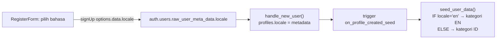

# I18N — Internationalization (ID/EN)

Panduan sistem multi-bahasa: string UI diterjemahkan lewat katalog, sedangkan **data user (nama kategori, akun, deskripsi) TIDAK diterjemahkan** — cukup di-seed di bahasa yang benar saat signup.

> Konsep dasar & keputusan ada juga di [`FEATURES.md` §13](./FEATURES.md#13-internationalization-i18n). Dokumen ini versi teknis + peta kode.
> Status: **SELESAI** — seluruh UI (auth, home, transaksi, nav, settings, cicilan, investasi, budget, bulk, saldo, admin, insights, connect) sudah bilingual ID/EN. Katalog: `dashboard/src/i18n/locales/{id,en}/common.json`. Cara nambah string baru: [§7](#7-nambah-string--konversi-layar-baru-phase-2).

## Daftar Isi
- [1. Prinsip: dua jenis teks](#1-prinsip-dua-jenis-teks)
- [2. Arsitektur](#2-arsitektur)
- [3. Locale: dari mana sumbernya](#3-locale-dari-mana-sumbernya)
- [4. Alur signup → seed bahasa](#4-alur-signup--seed-bahasa)
- [5. Katalog & pemakaian `t()`](#5-katalog--pemakaian-t)
- [6. Formatters (angka/tanggal)](#6-formatters-angkatanggal)
- [7. Nambah string / konversi layar baru (Phase 2)](#7-nambah-string--konversi-layar-baru-phase-2)
- [8. Test](#8-test)
- [9. Peta kode](#9-peta-kode)

---

## 1. Prinsip: dua jenis teks

| Jenis | Contoh | Cara | i18n handle? |
|---|---|---|---|
| **String UI** | tombol, label, nav, pesan | katalog `t('key')` | ✅ |
| **Data user (DB)** | nama kategori/akun, deskripsi transaksi | value tabel milik user | ❌ — di-seed di bahasa benar saat lahir, habis itu apa adanya |

Kategori `"Makan"` yang dibuat user bukan "Indonesia yang perlu ditranslate" — itu label dia. Toggle bahasa **tidak** menyentuh data ini. Yang membedakan bahasa cuma **list mana yang di-insert** saat signup.

## 2. Arsitektur

- **Library:** `react-i18next` + `i18next` (client-only, SPA `ssr:false`).
- **Init sekali** di entry: `dashboard/src/root.tsx` (`import '@/i18n'`). Resources inline (bukan async backend) → `useTranslation()` langsung siap, no suspense.
- **Namespace:** satu, `common` (boleh dipecah nanti).
- Setup: `dashboard/src/i18n/index.ts:22` (`i18n.use(initReactI18next).init(...)`).

## 3. Locale: dari mana sumbernya

Source of truth berlapis:
1. **`profiles.locale`** (DB) — otoritatif untuk user login. Kolom di `supabase/migrations/051_locale_and_localized_seed.sql:13`.
2. **`localStorage['locale']`** — cache anti-flash + dipakai pra-login (auth pages belum ada sesi). Baca: `i18n/index.ts:11` (`storedLocale`).

Bootstrap saat masuk app: `dashboard/src/routes/app-layout.tsx` clientLoader baca `profiles.locale` → `setLocale()` (`i18n/index.ts:35`) → `i18next.changeLanguage` + tulis localStorage + set `document.documentElement.lang`.

Ganti bahasa (toggle) → `setLocale()` + `PATCH /api/profile { locale }` (persist). Toggle: `dashboard/src/components/settings/SettingsClient.tsx` (`LanguageSection`).

## 4. Alur signup → seed bahasa



- Picker + kirim metadata: `dashboard/src/components/auth/RegisterForm.tsx` (`signUp({ options: { data: { display_name, locale } } })`).
- `handle_new_user()` baca `raw_user_meta_data->>'locale'`: `051...sql:19`.
- `seed_user_data()` cabang id/en: `051...sql:32`. **Wajib `SET search_path = public` + qualify `public.categories`** — fungsi ini jalan dari GoTrue (auth) yang search_path-nya gak include public; tanpa itu error `relation "categories" does not exist` dan **semua signup gagal**.
- API terima update locale: `api/src/routes/profile.ts` (validasi `id|en`).

Hanya pengaruhi **user baru**. User lama tetap pegang kategori mereka.

## 5. Katalog & pemakaian `t()`

Katalog: `dashboard/src/i18n/locales/{id,en}/common.json`. Struktur nested per area (`auth.*`, `nav.*`, `settings.*`, `common.*`, `languages.*`).

Pakai di komponen:
```tsx
import { useTranslation } from 'react-i18next';
const { t } = useTranslation();
// ...
<span>{t('nav.transactions')}</span>
<CardTitle>{t('auth.register.title')}</CardTitle>
{t('auth.register.checkEmailDesc', { email })}  // interpolasi {{email}}
```

Array/const yang dulu di module-scope (mis. nav) dipindah **ke dalam** komponen supaya re-render saat bahasa ganti — contoh `dashboard/src/components/layout/Sidebar.tsx`, `BottomNav.tsx`.

## 6. Formatters (angka/tanggal)

`dashboard/src/lib/utils.ts` — locale aktif dibaca dari i18next (`activeLocale()`):
- `formatRupiah` (`:20`): **prefix `Rp` tetap** (app native IDR), grouping ikut locale (`id` → titik, `en` → koma).
- `formatDate`/`formatDatetime` (`:26`,`:30`): dayjs `.locale(...)` → nama bulan ikut bahasa.
- `formatRupiahInput` grouping locale-aware.

**Belum di-locale-kan (Phase 2):** `rp()` compact `jt`/`rb`, const `TRANSACTION_TYPE_LABEL`, `SOURCE_LABEL`, `DAY_NAMES` — masih Indonesia. Pindahkan ke katalog saat konversi layar terkait.

## 7. Nambah string / konversi layar baru

Pola per komponen:
1. `const { t } = useTranslation();`
2. Ganti string hardcode → `t('area.key')`.
3. Tambah entri **di dua file**: `locales/id/common.json` **dan** `locales/en/common.json` (key sama).
4. String dinamis di module-scope → pindah ke dalam komponen, **atau** untuk helper/loader non-komponen pakai `import i18n from '@/i18n'` lalu `i18n.t(...)` (bukan hook).

**Gotcha:** map/callback param jangan dinamai `t` (bentrok sama translation `t`) — pakai `tt`/`opt`. Fungsi module-level (helper stats, clientLoader, config object) di luar scope komponen → wajib `i18n.t`, bukan `t`.

**Namespace katalog:** `common`, `auth`, `nav`, `settings`, `tx`, `filters`, `inst`, `inv`, `budget`, `balances`, `bulk`, `chart`, `sidebar`, `insight`, `home`, `more`, `notif`, `page`, `source`, `languages`.

## 8. Test

- `tests/integration/i18n-seed.test.js` — buat user via admin API dgn `user_metadata.locale` → assert kategori seed sesuai bahasa + `profiles.locale`. Guard inti (juga nangkep bug search_path).
- `dashboard/tests/unit/locale-format.test.ts` — `formatRupiah`/`formatDate` untuk id vs en (grouping & bulan).
- Jalankan: `SUPABASE_SERVICE_ROLE_KEY=xxx node tests/integration/i18n-seed.test.js` · `cd dashboard && pnpm test`.

## 9. Peta kode

| Layer | File |
|---|---|
| DB: locale + seed bahasa | `supabase/migrations/051_locale_and_localized_seed.sql` |
| i18n init + helper locale | `dashboard/src/i18n/index.ts` |
| Katalog | `dashboard/src/i18n/locales/{id,en}/common.json` |
| Init di entry | `dashboard/src/root.tsx` |
| Bootstrap locale dari profil | `dashboard/src/routes/app-layout.tsx` |
| Picker signup | `dashboard/src/components/auth/RegisterForm.tsx` |
| Toggle bahasa | `dashboard/src/components/settings/SettingsClient.tsx` (`LanguageSection`) |
| API persist locale | `api/src/routes/profile.ts` |
| Formatters | `dashboard/src/lib/utils.ts` |
| Slice UI | `components/auth/*`, `components/layout/{Sidebar,BottomNav}.tsx`, `routes/settings.tsx` |
| Test | `tests/integration/i18n-seed.test.js`, `dashboard/tests/unit/locale-format.test.ts` |

---

_Update dokumen ini saat nambah bahasa baru atau konversi layar Phase 2._
