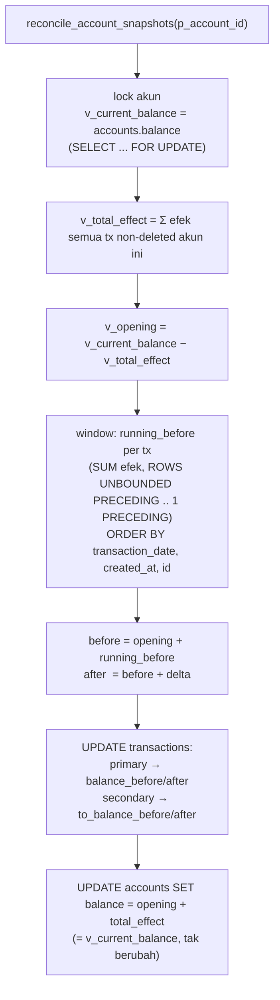
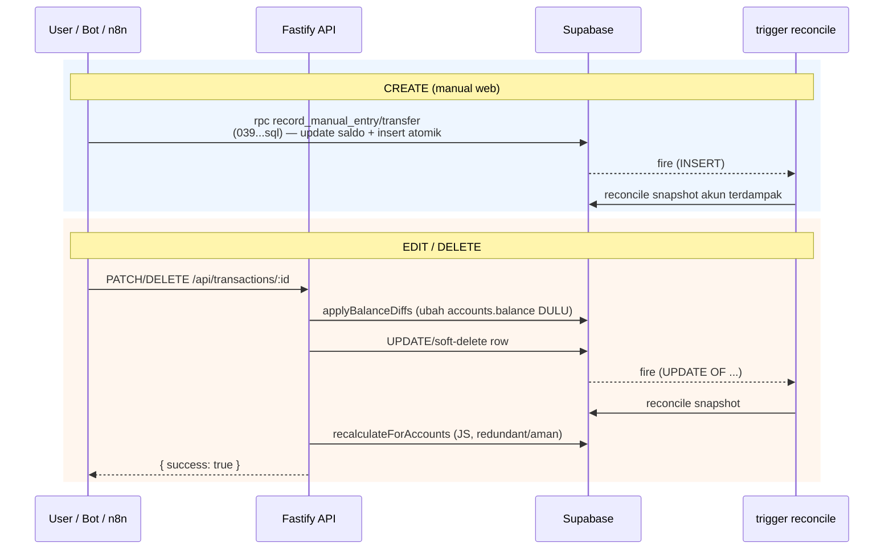

# RECONCILE — Sistem Saldo & Snapshot Kronologis

Deep-dive fitur paling rawan di sistem: **running balance snapshot** per transaksi dan mekanisme reconcile yang menjaganya tetap konsisten. Baca ini sebelum ngutak-ngatik apa pun yang menyentuh `accounts.balance` atau kolom `balance_*` di `transactions`.

> Ringkasannya ada di [`FEATURES.md` §4](./FEATURES.md#4-sistem-saldo--snapshot-advanced). Dokumen ini versi lengkapnya.
> Setiap klaim di bawah nempel pointer `file:line` ke kodenya — rujuk langsung ke sana kalau ragu.

## Daftar Isi
- [1. Apa & kenapa rawan](#1-apa--kenapa-rawan)
- [2. Kolom snapshot](#2-kolom-snapshot)
- [3. Kontrak inti](#3-kontrak-inti)
- [4. Algoritma `reconcile_account_snapshots`](#4-algoritma-reconcile_account_snapshots)
- [5. Efek per tipe transaksi](#5-efek-per-tipe-transaksi)
- [6. Dua sisi transfer & `to_amount`](#6-dua-sisi-transfer--to_amount)
- [7. Trigger: kapan reconcile jalan](#7-trigger-kapan-reconcile-jalan)
- [8. Jalur tulis (create / edit / delete)](#8-jalur-tulis-create--edit--delete)
- [9. Fungsi & tools pendukung](#9-fungsi--tools-pendukung)
- [10. Gotchas & runbook debugging](#10-gotchas--runbook-debugging)
- [11. Test](#11-test)
- [12. Peta kode](#12-peta-kode)

---

## 1. Apa & kenapa rawan

Tiap transaksi nyimpen **saldo akun sesudah transaksi itu** (`balance_after`) dan sebelumnya (`balance_before`). Ini yang bikin UI daftar transaksi bisa nampilin kolom "saldo" historis di tiap baris.

Rawannya: snapshot ini **turunan** dari `accounts.balance` + urutan kronologis. Begitu ada yang ganti urutan (edit tanggal), hapus transaksi tengah, atau ubah nominal, semua snapshot **setelah** titik itu jadi basi. Kalau reconcile-nya salah, UI nampilin saldo yang keliatan minus/anomali padahal saldo asli akun bener (kejadian nyata: ShopeePay keliatan −113rb palsu, lihat `supabase/migrations/040_reconcile_snapshots_use_to_amount.sql:5`).

## 2. Kolom snapshot

Di tabel `transactions` (`supabase/migrations/008_balance_traceability.sql`, `010_email_transactions_balance_snapshots.sql`):

| Kolom | Arti |
|---|---|
| `balance_before` / `balance_after` | Saldo **akun asal** (`account_id`) sebelum/sesudah transaksi. |
| `to_balance_before` / `to_balance_after` | Saldo **akun tujuan** (`to_account_id`) — cuma keisi untuk `transfer`. |

## 3. Kontrak inti

Tiga aturan yang **tidak boleh dilanggar**, kalau dilanggar snapshot langsung ngaco:

1. **`accounts.balance` = source of truth.** Snapshot selalu di-anchor ke saldo akun *sekarang*, bukan dihitung ulang dari nol. Reconcile menurunkan `opening = balance − Σefek`, lalu jalan maju.
2. **Reconcile PRESERVE `accounts.balance`.** Fungsi reconcile tidak pernah menambah/mengurangi saldo — di akhir dia nulis balik `balance = opening + Σefek` (nilainya sama). Lihat `040_reconcile_snapshots_use_to_amount.sql:112-118`. Yang **boleh** ubah saldo cuma:
   - RPC atomik `record_manual_entry` / `record_manual_transfer` (`039_atomic_manual_transaction_fns.sql:46`, `:10`)
   - API `applyBalanceDiffs` di edit/delete (`api/src/routes/transactions-id.ts:16`)
   - insert email dari n8n / RPC investasi
3. **Urutan kronologis** selalu `ORDER BY transaction_date, created_at, id` (`040...sql:74`). `id` sebagai tie-breaker terakhir biar deterministik.

> **Konsekuensi #2:** kalau kamu mau menghapus/mengecilkan transaksi, **ubah `accounts.balance` DULU, baru sentuh row-nya**, supaya trigger baca saldo yang sudah benar. API sudah handle urutan ini (`transactions-id.ts:207-211`).

## 4. Algoritma `reconcile_account_snapshots`

Fungsi inti, per satu akun. Definisi live: **`supabase/migrations/040_reconcile_snapshots_use_to_amount.sql:11`** (body) + trigger di `050_reconcile_trigger_to_amount.sql:15`.



Langkah + pointer:

| Langkah | Kode |
|---|---|
| Lock saldo akun (`FOR UPDATE`) | `040...sql:25-29` |
| Hitung `v_total_effect` (Σ efek) | `040...sql:35-49` |
| `v_opening = current − total` | `040...sql:51` |
| Window `running_before` kronologis | `040...sql:66-76` |
| `before`/`after` per tx | `040...sql:81-90` |
| Tulis snapshot (primary vs secondary) | `040...sql:91-110` |
| Tulis balik saldo (preserve) | `040...sql:112-118` |

Kenapa `opening = current − total` bukan mulai dari nol? Karena banyak akun sudah punya saldo awal / histori sebelum tracking dimulai. Anchor ke saldo sekarang menjamin **ujung chain selalu = saldo asli akun**, apa pun yang terjadi di tengah.

## 5. Efek per tipe transaksi

Tanda efek terhadap akun (`040...sql:37-42`):

| `type` | Sisi asal (`account_id`) | Sisi tujuan (`to_account_id`) |
|---|---|---|
| `income` | `+amount` | — |
| `investment_gain` | `+amount` | — |
| `expense` | `−amount` | — |
| `investment_loss` | `−amount` | — |
| `transfer` | `−amount` | `+COALESCE(to_amount, amount)` |

## 6. Dua sisi transfer & `to_amount`

Transfer muncul di **dua chain** sekaligus:
- **Primary** (akun asal) → nulis `balance_before/after`, efek `−amount`.
- **Secondary** (akun tujuan) → nulis `to_balance_before/after`, efek `+to_amount`.

`to_amount` dipakai untuk transfer dengan **admin fee** (mis. keluar 100rb, masuk 90rb, fee 10rb). Sisi tujuan harus kredit **90rb** (to_amount), bukan 100rb. Kalau salah pakai `amount`, opening balance akun tujuan ke-derive terlalu rendah → saldo keliatan minus.

Ini pernah bug di 3 tempat (SUM, delta CASE, window) dan diperbaiki mig 040. Trigger juga dulu **nggak fire** kalau yang diedit cuma `to_amount` → diperbaiki mig 050 (nambah `to_amount` ke kolom trigger). Lihat `050_reconcile_trigger_to_amount.sql:1-12`.

## 7. Trigger: kapan reconcile jalan

`trg_reconcile_transaction_snapshots` (`050...sql:15`) → memanggil `reconcile_transaction_snapshots_on_change()` (`011...sql:132`) yang loop tiap akun terdampak lalu `PERFORM reconcile_account_snapshots(...)`.

```sql
AFTER INSERT OR DELETE OR UPDATE OF
  type, amount, to_amount, account_id, to_account_id, transaction_date, is_deleted
```

- **INSERT** → reconcile `NEW.account_id` + `NEW.to_account_id` (`011...sql:137-145`)
- **UPDATE** → reconcile gabungan OLD & NEW akun (`011...sql:146-154`) — nangkep kasus pindah akun
- **DELETE / soft-delete** → reconcile `OLD.account_id` + `OLD.to_account_id` (`011...sql:155-163`)

Fire **apa pun sumbernya** (API, telegram bot, n8n email) — makanya ini disebut auto-heal. Karena cuma di `UPDATE OF` kolom-kolom itu, edit deskripsi/kategori/merchant **tidak** memicu reconcile (hemat, dan `update_updated_at` juga skip biar `updated_at` stabil — `011...sql:6-21`).

## 8. Jalur tulis (create / edit / delete)



- **Create:** `api/src/routes/transactions.ts` → RPC (`039_atomic_manual_transaction_fns.sql`). Saldo di-update di dalam RPC, snapshot diurus trigger.
- **Edit:** `api/src/routes/transactions-id.ts:88` — hitung diff (`balance-math.ts:39`), `applyBalanceDiffs` (`:16`), build snapshot (`buildSnapshotForState`, `balance-math.ts:60`), update row, lalu `recalculateForAccounts` (`:189`).
- **Delete (soft):** `transactions-id.ts:197` — balikin efek ke saldo (`invertEffects`, `balance-math.ts:52`), set `is_deleted=true`, `recalculateForAccounts` (`:219`).
- **Recalc manual:** `POST /api/transactions/recalculate` (`transactions-recalculate.ts:6`) → `recalculateForAccounts` untuk akun yang dikirim.

### Kenapa DUA mekanisme (trigger DB + JS `recalculateForAccounts`)?

Redundan tapi disengaja. `recalculateForAccount` (`api/src/lib/recalculate-snapshots.ts:3`) mengulang logika reconcile di sisi API (jalan mundur dari saldo sekarang, `ORDER BY transaction_date DESC`). Trigger DB yang jadi **jaring pengaman universal** (nangkep tulisan dari bot/n8n yang nggak lewat API). Keduanya konvergen ke hasil yang sama karena sama-sama anchor ke `accounts.balance`.

## 9. Fungsi & tools pendukung

| Objek | Peran | Kode |
|---|---|---|
| `reconcile_account_snapshots(uuid)` | Reconcile 1 akun (dipanggil trigger). | `040...sql:11` |
| `reconcile_transaction_snapshots_on_change()` | Trigger fn, loop akun terdampak. | `011...sql:132` |
| `reconcile_balance_snapshots()` | Reconcile **global** semua akun (manual, pakai window per-akun). | `050...sql:21` (asal `018...sql:18`) |
| `get_balance_snapshot_anomalies(uuid?)` | Health-check: cari snapshot inkonsisten. | `012_snapshot_health_check.sql:5` |
| `recalculateForAccount(s)` | Mirror reconcile di API. | `api/src/lib/recalculate-snapshots.ts:3`, `:76` |
| `POST /api/transactions/recalculate` | Trigger reconcile manual dari dashboard. | `api/src/routes/transactions-recalculate.ts:6` |
| `balance-math.ts` | `getEffects` / `diffEffects` / `invertEffects` / `buildSnapshotForState`. | `api/src/lib/balance-math.ts:19,39,52,60` |

## 10. Gotchas & runbook debugging

- **Urutan delete/kecilin:** ubah `accounts.balance` dulu, baru row. Kebalik → trigger baca saldo lama, snapshot bener tapi "opening" geser (auto-heal preserve saldo lama).
- **Edit deskripsi/kategori nggak trigger reconcile** — memang sengaja (bukan kolom efek). Jangan heran snapshot nggak berubah.
- **Nambah `type` transaksi baru** (mis. tipe efek baru) → wajib update CASE di `reconcile_account_snapshots` (`040...sql`), `recalculate-snapshots.ts`, dan `balance-math.ts`. Kalau lupa salah satu, snapshot antara DB & API bakal beda.
- **Cek anomali:** `SELECT * FROM get_balance_snapshot_anomalies();` (via Supabase MCP). Kalau ada baris → jalankan `SELECT reconcile_balance_snapshots();` untuk heal semua akun sekaligus.
- **Reconcile 1 akun manual:** `SELECT reconcile_account_snapshots('<account_uuid>');`.

## 11. Test

`tests/integration/reconcile-snapshots.test.js` — exercise trigger DB langsung (tanpa API server):
- insert kronologis → chain naik urut
- **ganti tanggal** (reorder) → snapshot recompute, saldo tetap
- **hapus tengah** → saldo turun + chain sisa benar
- **edit amount tengah** → tx sesudahnya geser
- **transfer `to_amount`** (admin fee) → sisi tujuan kredit to_amount (guard mig 050)

Pendukung: `tests/integration/atomic-balance.test.js` (lost-update), `tests/unit/balance-snapshot-patch.test.js` (logika snapshot API).
Jalankan: `SUPABASE_SERVICE_ROLE_KEY=xxx node tests/integration/reconcile-snapshots.test.js` (atau `bash tests/run-all.sh`).

## 12. Peta kode

| Layer | File |
|---|---|
| Fungsi reconcile per-akun | `supabase/migrations/040_reconcile_snapshots_use_to_amount.sql` |
| Trigger fn + definisi trigger | `supabase/migrations/011_reconcile_transaction_snapshots.sql`, `050_reconcile_trigger_to_amount.sql` |
| Reconcile global | `supabase/migrations/018_reconcile_balance_snapshots_fn.sql` |
| Health-check | `supabase/migrations/012_snapshot_health_check.sql` |
| Kolom snapshot | `supabase/migrations/008_balance_traceability.sql`, `010_email_transactions_balance_snapshots.sql` |
| Create atomik (RPC) | `supabase/migrations/039_atomic_manual_transaction_fns.sql` |
| Edit/Delete API | `api/src/routes/transactions-id.ts` |
| Reconcile JS (mirror) | `api/src/lib/recalculate-snapshots.ts` |
| Math efek/snapshot | `api/src/lib/balance-math.ts` |
| Endpoint recalc manual | `api/src/routes/transactions-recalculate.ts` |
| Test | `tests/integration/reconcile-snapshots.test.js` |

---

_Update dokumen ini kalau ubah logika efek, kolom trigger, atau tambah tipe transaksi._
